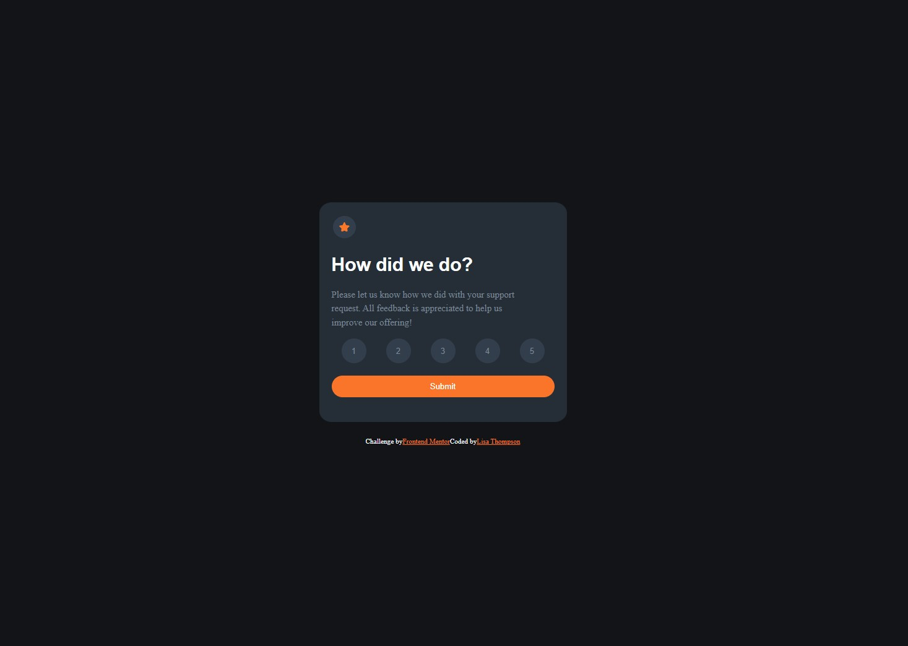

# Frontend Mentor - Interactive rating component solution

This is a solution to the [Interactive rating component challenge on Frontend Mentor](https://www.frontendmentor.io/challenges/interactive-rating-component-koxpeBUmI). Frontend Mentor challenges help you improve your coding skills by building realistic projects. 

## Table of contents

- [Overview](#overview)
  - [The challenge](#the-challenge)
  - [Screenshot](#screenshot)
  - [Links](#links)
- [My process](#my-process)
  - [Built with](#built-with)
  - [What I learned](#what-i-learned)
  - [Continued development](#continued-development)
 


# Overview

### The challenge

Users should be able to:

- View the optimal layout for the app depending on their device's screen size
- See hover states for all interactive elements on the page
- Select and submit a number rating
- See the "Thank you" card state after submitting a rating

### Screenshot




### Links

- Solution URL: [https://www.frontendmentor.io/solutions/interactive-card-with-sass-and-javasript-KZ27XCnATI]
- Live Site URL: [https://lisacodesnow.github.io/interactive-rating-card/]
## My process

- Build out the site mobile first. In this case this card stays the same size regardless of the screen size.
- Coded HTML first
- This is my second project using SCSS so I build from out to in. Building the structure
  -Meaning I start with positiong all of the elements. 
  - I use flex, figure out padding, margins, etc...
  - Color, line-height, and final tweeks goes last because its the tiny things

### Built with

- Semantic HTML5 markup
- SCSS
- Flexbox
- Mobile-first workflow


### What I learned

- Became more comforable with SCSS.
- Utilized puesdo classes: hover, focus and used the cursor property
  - Hover is used to change the color of the button when the pointer hovers
  - Focus is used to change the color when the button is pressed
    -  ```scss
      &:hover{
							background-color: $orange;
							color: $white;
						}

      &:focus{
							background-color: $light-grey;
							color: $white;
						}
      
      cursor: pointer;
      ```

- Used two classes in html so I could hide the back of the card
  ```html
  <div class="thank_you_content-wrapper hide">
  ```

  - And then I styled the hide class and used !important to take precedence over other stylesheets on the web
    ```scss
      .hide{
				 /* '!important' is to make sure that when we add the class using JS, it takes precendence */
   				 display: none !important;
    ```

- BIGGEST OBSTACLE I LEARNED FROM

  - Used JS to display the number of the button on the back of the card after I hit submit
    1. Gave each button a class AND ID so each button can be selected. If it only has the same class NOTHING will be selected.
    ```html
       <div class="number_rating">  
			 <button class="button_1" id="1"> 1</button>
			  <button class="button_1" id="2"> 2</button>
			  <button class="button_1" id="3"> 3</button>
			  <button class="button_1" id="4"> 4</button>
			  <button class="button_1" id="5"> 5</button>
		</div>
  ```
  2. Used querySelectorAll INSTEAD of querySelector. Since its a list I had to select the whole list. 
    ```js
    const button = document.querySelectorAll(".button_1"); //because its a list with the same class I have to use querySelectorAll so it can select the list. Because its a list I don't have to put the buttons in an array
    ```
  3. Used foreach method to loop through the list so the button that's pushed can be displayed on the back of the card
    ```js
    //forEach function is used to loop through an array, list, which is what button is by using the querySelectorAll
	button.forEach(function(buttonPushed){
		buttonPushed.addEventListener("click", function(){
			ratingSelected.innerHTML = buttonPushed.innerHTML;
				});
	
});
    ```


### Continued development

- I want to focus on what elements I need in JS to do what I want to 
- Like knowing how and when to use certain things in JS
Use this section to outline areas that you want to continue focusing on in future projects. These could be concepts you're still not completely comfortable with or techniques you found useful that you want to refine and perfect.


## Author

- Website - [https://www.lisacodesnow.com]
- Frontend Mentor - [https://www.frontendmentor.io/profile/lisacodesnow]
